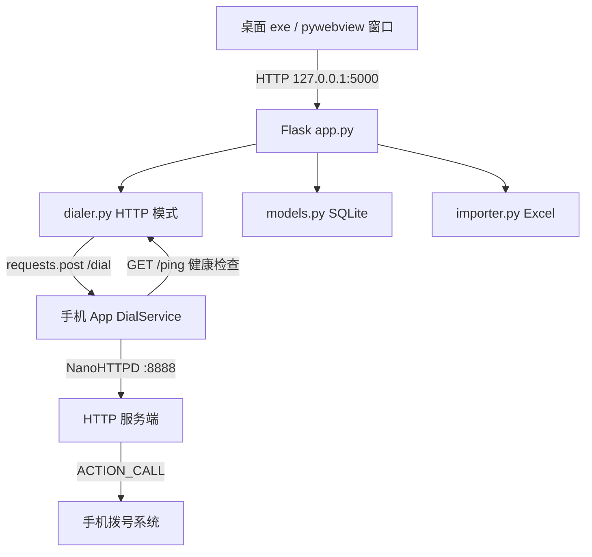

## 产品概述

将现有基于 ADB 无线调试的一键拨号工具升级为企业级方案：开发一个极简安卓 App 替代 ADB，App 安装即有拨号权限（CALL_PHONE），后台运行嵌入式 HTTP 服务接收拨号指令。桌面客户端从 ADB subprocess 命令切换为 HTTP 请求直连手机 App，实现真正的全自动一键拨号，无需开发者模式、配对码、端口配置。

## 核心功能

- **安卓拨号 App**：安装即用，声明 CALL_PHONE 权限，后台前台服务常驻 HTTP 服务，收到 POST /dial 请求即触发 ACTION_CALL 全自动拨号
- **App 主界面**：显示手机局域网 IP 地址和服务端口（供桌面端配置），显示服务运行状态，一键启动/停止服务
- **桌面客户端改造**：拨号模块从 ADB subprocess 改为 HTTP requests，连接状态检测从 adb devices 改为 HTTP /ping 健康检查
- **全自动拨号**：App 自身有 CALL_PHONE 权限，不再受 HyperOS ADB shell 权限限制，100% 全自动拨号
- **零配置连接**：手机只需安装 App 并保持同一局域网，桌面端填入手机 IP 即可使用

## 技术栈

### 安卓 App（新建）

- **语言**：Kotlin
- **HTTP 服务**：NanoHTTPD（单文件嵌入式 HTTP 服务器，零外部依赖，体积约 80KB）
- **后台保活**：Android Foreground Service（前台服务 + 持久通知，防止系统杀进程）
- **UI**：Android 原生 XML 布局（Material Design 组件，极简界面）
- **最低 SDK**：Android 8.0（API 26，覆盖 99% 设备）
- **构建工具**：Gradle Kotlin DSL

### 桌面客户端（改造现有）

- **后端框架**：Flask 3.0（不变）
- **HTTP 客户端**：requests 2.32（新增，替代 subprocess 调用 ADB）
- **数据库**：SQLite（不变）
- **前端**：Bootstrap 5 + Bootstrap Icons（不变）
- **桌面窗口**：pywebview 6.2（不变）
- **打包**：PyInstaller 6.21（不变，移除 platform-tools 依赖）

## 实现方案

### 核心改造策略：ADB subprocess -> HTTP requests

**改造前**（ADB 方案）：

```
桌面 exe -> subprocess.run(["adb", "shell", "am", "start", "-a", "ACTION_CALL", ...]) -> 手机拨号
```

**改造后**（App 方案）：

```
桌面 exe -> requests.post("http://手机IP:8888/dial", json={"phone": "138xxx"}) -> App 收到 -> ACTION_CALL 拨号
```

### 安卓 App 设计

App 提供 3 个 HTTP 接口：

- `GET /ping` -- 健康检查，返回 `{"status":"ok","device":"设备型号"}`
- `POST /dial` -- 接收 `{"phone":"138xxx"}`，执行 `ACTION_CALL` 拨号，返回 `{"success":true,"message":"正在拨打 138xxx"}`
- `GET /` -- 浏览器访问首页，显示 App 状态页面

App 核心流程：

1. 用户打开 App -> 授权 CALL_PHONE 运行时权限
2. 点击「启动服务」-> DialService 前台服务启动 -> NanoHTTPD 监听 0.0.0.0:8888
3. 桌面端发 HTTP 请求 -> App 收到 -> 调用 `startActivity(Intent(ACTION_CALL, Uri.parse("tel:号码")))`
4. 手机自动拨出电话，无需任何手动操作

### 关键技术决策

1. **NanoHTTPD 而非 Ktor/OkHttp**：NanoHTTPD 是单文件嵌入式 HTTP 服务器，零依赖，体积小，适合极简场景；Ktor 需要 Kotlin Coroutines 和大量依赖，过度设计
2. **固定端口 8888**：避免动态端口带来的配置麻烦，用户只需填 IP 不需要填端口
3. **ACTION_CALL 而非 ACTION_DIAL**：App 自己声明了 CALL_PHONE 权限，安装即有，不需要降级到半自动模式
4. **前台服务而非普通 Service**：Android 8.0+ 后台服务限制严格，前台服务 + 持久通知可保持 HTTP 服务常驻不被杀
5. **requests 库替代 subprocess**：简单可靠，自带超时和异常处理，代码可读性远高于 subprocess
6. **保留 ADB 代码作为备用**：dialer.py 保留 ADB 相关函数，新增 HTTP 拨号函数，通过配置切换模式，向后兼容

### 性能与可靠性

- **HTTP 请求超时**：requests 设置 5 秒超时，避免手机离线时桌面端挂起
- **App 服务保活**：前台服务 + `START_STICKY` 重启策略，系统杀掉后自动重启
- **号码安全校验**：桌面端和 App 端双重校验，仅允许数字和 + 号，防止注入
- **网络兼容**：同一局域网直连，不依赖 ADB 协议，不受 AP 隔离影响（App 主动监听端口）

## 实现注意事项

### 执行细节

- **dialer.py 改造**：保留现有 ADB 函数不删除，新增 `dial_number_http()` 函数，`dial_number()` 根据 Config 选择 ADB 或 HTTP 模式。这样向后兼容，用户可以选择用哪种方式
- **config.py 改造**：新增 `APP_HOST` 和 `APP_PORT` 配置项，保留 `ADB_DEVICE_IP/PORT` 不删除
- **app.py 改造**：`/api/status` 同时检测 ADB 和 HTTP 两种连接模式，返回当前可用模式
- **index.html 改造**：状态卡片显示「手机 App 连接状态」替代「ADB 连接状态」，保留连接/重连按钮逻辑
- **build.bat 改造**：移除复制 platform-tools 的步骤和提示，因为 App 方案不再需要 ADB 工具
- **.env 改造**：新增 `APP_HOST` 和 `APP_PORT` 配置项，注释说明用途

### 性能关注点

- HTTP 拨号请求耗时约 50-200ms（局域网），远快于 ADB 命令的 1-3 秒
- App HTTP 服务内存占用约 5-10MB，前台服务通知不会影响用户体验
- 桌面端状态轮询间隔保持 5 秒不变，HTTP /ping 请求极轻量

### 日志与调试

- App 端使用 Android Log 输出拨号记录到 Logcat，方便调试
- 桌面端保持现有拨号历史记录功能不变

### 向后兼容

- 保留 ADB 模式作为备用，通过 .env 配置切换 `DIAL_MODE=app` 或 `DIAL_MODE=adb`
- 现有 contacts.db 数据完全兼容，无需迁移

## 架构设计



### 模块职责

**安卓 App 模块**：

- `MainActivity.kt` -- App 入口界面，显示 IP/端口/状态，权限请求，启动服务按钮
- `DialService.kt` -- 前台服务，内嵌 NanoHTTPD，处理 /ping 和 /dial 请求
- `BootReceiver.kt` -- 开机自启动服务（可选）
- `AndroidManifest.xml` -- 声明权限和服务组件

**桌面客户端改造模块**：

- `dialer.py` -- 新增 HTTP 拨号函数，保留 ADB 函数作为备用
- `config.py` -- 新增 APP_HOST/APP_PORT 配置
- `app.py` -- 状态接口支持 HTTP 模式
- `templates/index.html` -- UI 文案适配

## 目录结构

### 安卓 App（新建）

```
e:\iphone-desktop-auto\android-app\
├── build.gradle.kts                    # [NEW] 根 Gradle 构建配置
├── settings.gradle.kts                 # [NEW] Gradle 项目设置
├── gradle.properties                   # [NEW] Gradle 属性配置
├── app/
│   ├── build.gradle.kts                # [NEW] App 模块构建配置（依赖 NanoHTTPD，minSdk 26）
│   └── src/main/
│       ├── AndroidManifest.xml         # [NEW] 声明 CALL_PHONE/INTERNET/FOREGROUND_SERVICE/RECEIVE_BOOT_COMPLETED 权限，注册 Service 和 Receiver
│       ├── java/com/dialer/
│       │   ├── MainActivity.kt         # [NEW] App 主界面，显示 IP 地址和端口，权限请求，启动/停止服务按钮
│       │   ├── DialService.kt          # [NEW] 前台服务，内嵌 NanoHTTPD HTTP 服务器，处理 /ping 和 /dial 请求，调用 ACTION_CALL 拨号
│       │   └── BootReceiver.kt         # [NEW] 开机自启动广播接收器，自动启动 DialService
│       └── res/
│           ├── layout/activity_main.xml # [NEW] 主界面布局，Material Design 风格
│           ├── values/strings.xml      # [NEW] 字符串资源
│           ├── values/colors.xml       # [NEW] 颜色资源
│           └── drawable/ic_phone.xml   # [NEW] 通知图标
```

### 桌面客户端（改造现有）

```
e:\iphone-desktop-auto\
├── dialer.py                           # [MODIFY] 新增 dial_number_http() 函数，dial_number() 支持 HTTP/ADB 双模式切换
├── config.py                           # [MODIFY] 新增 APP_HOST/APP_PORT/DIAL_MODE 配置项
├── app.py                              # [MODIFY] /api/status 和 /api/connect 支持 HTTP 健康检查模式
├── templates/index.html                # [MODIFY] 状态卡片 UI 从「ADB连接状态」改为「手机App连接状态」
├── paths.py                            # [MODIFY] 更新 data_path 注释，移除 platform-tools 引用说明
├── build.bat                           # [MODIFY] 移除复制 platform-tools 步骤和提示
├── requirements.txt                    # [MODIFY] 新增 requests 依赖
├── .env                                # [MODIFY] 新增 APP_HOST/APP_PORT/DIAL_MODE 配置
├── .env.example                        # [MODIFY] 新增 APP_HOST/APP_PORT/DIAL_MODE 模板
├── README.md                           # [MODIFY] 更新文档，新增安卓 App 安装说明
├── models.py                           # 不变
├── importer.py                         # 不变
├── main.py                             # 不变
```

## 关键代码结构

### DialService.kt -- App 核心 HTTP 服务

```
class DialService : Service() {
    private var server: NanoHTTPD? = null

    inner class DialServer(port: Int) : NanoHTTPD(port) {
        override fun serve(session: IHTTPSession): Response {
            return when (session.uri) {
                "/ping" -> newFixedLengthResponse(
                    Response.Status.OK, "application/json",
                    """{"status":"ok","device":"${Build.MODEL}"}"""
                )
                "/dial" -> {
                    val phone = parsePhoneFromSession(session)
                    if (phone.isNotEmpty()) {
                        val intent = Intent(Intent.ACTION_CALL, Uri.parse("tel:$phone"))
                        intent.addFlags(Intent.FLAG_ACTIVITY_NEW_TASK)
                        startActivity(intent)
                        newFixedLengthResponse(Response.Status.OK, "application/json",
                            """{"success":true,"message":"正在拨打 $phone"}""")
                    } else {
                        newFixedLengthResponse(Response.Status.BAD_REQUEST, "application/json",
                            """{"success":false,"message":"号码为空"}""")
                    }
                }
                else -> newFixedLengthResponse(Response.Status.NOT_FOUND, "text/plain", "404")
            }
        }
    }
}
```

### dialer.py -- HTTP 拨号函数签名

```python
def dial_number_http(phone: str) -> tuple[bool, str]:
    """通过 HTTP 请求触发手机 App 拨号。

    Args:
        phone: 要拨打的电话号码

    Returns:
        (成功与否, 消息)
    """
    # 清理号码
    clean_phone = "".join(c for c in phone if c.isdigit() or c == "+")
    # POST http://APP_HOST:APP_PORT/dial
    # 返回 (success, message)
```

## Agent Extensions

### Skill

- **Android 原生开发**
- Purpose: 指导安卓 App 的 Kotlin 代码编写、AndroidManifest.xml 权限声明、前台服务实现、Material Design UI 布局，确保符合 Android 最佳实践
- Expected outcome: 安卓 App 代码符合 Android 开发规范，前台服务和权限声明正确，能在小米17 HyperOS 上稳定运行

### MCP

- **codeguard**
- Purpose: 对改造后的 dialer.py 和 app.py 进行安全扫描，确保 HTTP 请求中的电话号码不会被注入到 URL 或请求体中，检测 SSRF 风险
- Expected outcome: 安全扫描通过，无命令注入/SSRF 漏洞，代码安全可信赖