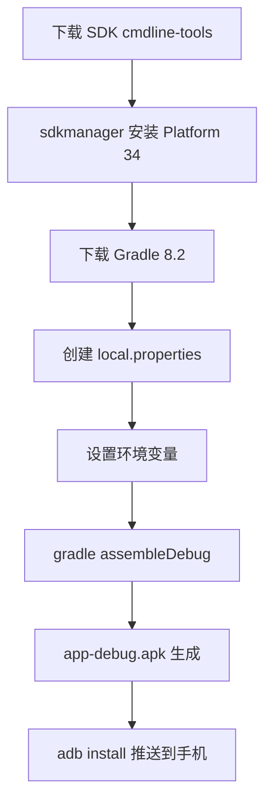

## 产品概述

将已有的安卓拨号 App 源代码（Kotlin + NanoHTTPD）编译为 debug APK 安装包，安装到小米17手机上，实现手机端一键拨号服务。

## 核心功能

- **命令行编译 APK**：不安装 Android Studio，仅用 SDK Command-line Tools + Gradle 8.2 + JDK 17 编译
- **全 F 盘部署**：Android SDK、Gradle、Gradle 缓存全部安装在 F 盘，C 盘不新增文件
- **ADB 安装到手机**：编译完成后直接用已有 platform-tools 推送安装

## 技术栈

- **JDK**: 17.0.12（已存在，路径 `D:\IDEA\IntelliJ IDEA 2026.1.3\JDK\jdk-17.0.12`，只读引用）
- **Gradle**: 8.2（需下载到 `F:\gradle-8.2\`，约 130MB）
- **Android SDK**: Command-line Tools + Platform 34 + Build Tools 34（需下载到 `F:\android-sdk\`，约 230MB）
- **Gradle 缓存**: `F:\gradle-cache`（设 `GRADLE_USER_HOME` 环境变量，避免写入 C 盘）
- **ADB**: 已有 `e:\iphone-desktop-auto\platform-tools\adb.exe`

## 实现方案

### 核心原理

用 Android SDK Command-line Tools 替代 Android Studio 的 GUI，通过 `sdkmanager` 下载 SDK 组件，用 Gradle 命令行直接编译 APK。

### 项目缺失文件（已通过文件系统探索确认）

| 缺失项 | 说明 | 解决方案 |
| --- | --- | --- |
| Gradle Wrapper 脚本 | `gradlew.bat` 和 `gradle-wrapper.jar` 不存在 | 直接下载 Gradle 8.2 发行版到 F 盘，绕过 Wrapper |
| `local.properties` | 指向 SDK 路径的配置文件不存在 | 创建，指定 `sdk.dir=F:\android-sdk` |
| Android SDK | 完全未安装 | 下载 Command-line Tools，用 sdkmanager 安装 Platform 34 + Build Tools 34 |


### 关键技术决策

1. **直接下载 Gradle 8.2 而非修复 Wrapper**：项目缺少 `gradlew.bat` 和 `gradle-wrapper.jar`，修复 Wrapper 仍需要 Gradle 先运行，鸡生蛋问题。直接下载 Gradle 8.2 发行版更简单。
2. **`GRADLE_USER_HOME=F:\gradle-cache`**：Gradle 默认缓存到 `C:\Users\用户\.gradle`，必须重定向到 F 盘。
3. **JDK 17 而非系统 JDK 25**：系统 PATH 的 Java 是 25.0.2，AGP 8.2.0 仅支持 JDK 17。通过设置 `JAVA_HOME` 环境变量指向 IntelliJ 内置的 JDK 17。
4. **debug APK 而非 release**：debug 包不需要签名，直接可装。release 包需要生成签名密钥，复杂度更高。

### 性能与存储

- 总下载量约 400MB（SDK 230MB + Gradle 130MB + 依赖缓存 300MB）
- 首次 Gradle 构建约 3-5 分钟（下载 AGP + Kotlin 插件 + AndroidX 依赖）
- 后续构建约 30 秒
- F 盘需预留约 1GB 空间

## 实现注意事项

### 环境变量配置（每次命令行会话需设置）

```
$env:JAVA_HOME = "D:\IDEA\IntelliJ IDEA 2026.1.3\JDK\jdk-17.0.12"
$env:GRADLE_USER_HOME = "F:\gradle-cache"
$env:ANDROID_HOME = "F:\android-sdk"
$env:Path = "$env:JAVA_HOME\bin;F:\gradle-8.2\bin;F:\android-sdk\cmdline-tools\latest\bin;$env:Path"
```

### SDK 许可协议

`sdkmanager` 首次使用需要接受许可协议，通过 `sdkmanager --licenses` 自动接受所有许可。

### 编译失败排查

- 若报 `SDK location not found`：检查 `local.properties` 中的 `sdk.dir` 路径
- 若报 `Java version not supported`：确认 `JAVA_HOME` 指向 JDK 17 而非 JDK 25
- 若报 `Could not resolve`：检查网络连接，Gradle 需要从 Google Maven 和 Maven Central 下载依赖

### 向后兼容

- 编译后的 APK 不影响桌面端 exe，两者独立运行
- APK 安装后手机端 App 和桌面端通过 HTTP 通信，不依赖 ADB

## 架构设计



## 目录结构

```
F:\
├── android-sdk\                         # [NEW] Android SDK 根目录
│   └── cmdline-tools\
│       └── latest\                       # Command-line Tools 解压位置
│           └── bin\sdkmanager.bat
│   # Platform 34 和 Build Tools 34 通过 sdkmanager 下载到此目录下
│
├── gradle-8.2\                           # [NEW] Gradle 8.2 发行版
│   └── bin\gradle.bat
│
└── gradle-cache\                         # [NEW] Gradle 缓存（依赖、构建缓存）
    └── caches\                           # 首次构建后约 300-500MB

e:\iphone-desktop-auto\android-app\
├── local.properties                      # [NEW] SDK 路径配置: sdk.dir=F:\android-sdk
├── build.gradle.kts                      # 已有，不修改
├── settings.gradle.kts                   # 已有，不修改
├── gradle.properties                     # 已有，不修改
├── gradle\wrapper\gradle-wrapper.properties  # 已有，不修改
├── app\
│   ├── build.gradle.kts                  # 已有，不修改
│   └── src\main\                         # 已有，不修改
│       └── java\com\dialer\              # Kotlin 源码
│
└── app\build\outputs\apk\debug\          # [BUILD OUTPUT] 编译产物
    └── app-debug.apk                     # 最终 APK 文件
```