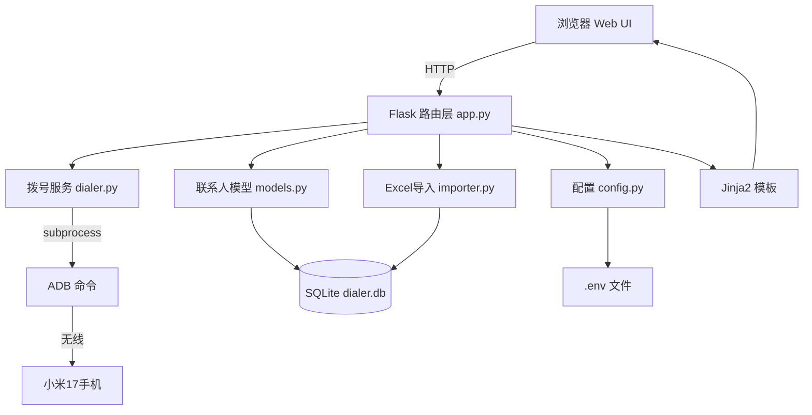

## 产品概述

一款个人使用的一键拨号桌面工具。用户在 Windows PC 上打开网页，点击联系人即可触发小米17手机自动拨号。通过 ADB 无线连接实现 PC 与手机通信，支持联系人管理、Excel 批量导入、拨号历史记录等功能。

## 核心功能

- **一键拨号**：网页点击联系人拨号按钮，手机立即自动拨出电话
- **ADB 连接管理**：自动检测/显示手机连接状态，支持一键重连
- **联系人管理**：增删改查联系人（姓名、电话、备注），支持搜索筛选
- **Excel 导入**：上传 .xlsx 文件批量导入联系人，自动识别姓名/电话列
- **拨号历史**：记录每次拨号的时间、号码、成功/失败状态，支持查看历史记录
- **网页访问**：局域网内手机/平板浏览器也可访问操作

## 技术栈

- **后端框架**：Flask 3.0.x（轻量 Web 框架，Jinja2 模板渲染）
- **数据库**：SQLite 3（Python 内置 sqlite3 模块，零配置）
- **ADB 通信**：subprocess 调用 adb 命令（无线连接模式）
- **Excel 处理**：openpyxl（读取 .xlsx 文件）
- **配置管理**：python-dotenv（.env 文件读取）
- **前端**：HTML5 + Bootstrap 5.3 + Bootstrap Icons + 自定义 CSS
- **Python 版本**：3.10+（用户环境兼容）

## 实现方案

### 核心原理

PC 端 Flask 运行本地 Web 服务，用户在浏览器操作；点击拨号时，后端通过 `subprocess` 执行 `adb shell am start -a android.intent.action.CALL -d tel:号码`，触发已无线连接的小米17手机自动拨号。

### 关键技术决策

1. **Flask 而非 PyQt**：开发更快、无需 GUI 框架学习成本、手机/平板也可通过浏览器访问
2. **SQLite 而非 MySQL**：零配置零安装，单文件数据库，个人使用足够
3. **subprocess 列表参数而非 shell=True**：防止电话号码中注入恶意命令（关键安全决策）
4. **Jinja2 服务端渲染而非 SPA**：用户 Python 基础，SSR 更简单可维护，无需前端构建工具链

### 安全设计

- 电话号码严格校验：仅允许数字、`+`、`-`、空格，正则 `^[\d+\-\s]+ 过滤
- subprocess 使用列表参数 `["adb", "shell", "am", "start", ...]`，杜绝 shell 注入
- Flask 开启 `debug=False`，监听 `0.0.0.0` 供局域网访问但仅个人使用
- .env 文件不入 Git（.gitignore 排除）

### 性能考量

- 联系人列表使用 SQLite 索引（phone 字段），搜索使用 LIKE 查询，个人数据量(<1000条)无瓶颈
- ADB 命令设置 5 秒超时，避免手机断连时请求挂起
- Excel 导入采用批量 INSERT 事务提交，避免逐条写入

## 架构设计



### 模块职责

- **app.py**：Flask 主程序，所有路由定义，请求分发，模板渲染
- **dialer.py**：ADB 连接检测、拨号执行、连接管理（重连）
- **models.py**：SQLite 数据库初始化、Contact/CallHistory 表操作
- **importer.py**：Excel 文件解析、数据校验、批量导入
- **config.py**：读取 .env 配置（ADB 路径、手机 IP、端口等）
- **templates/index.html**：单页 Web 界面
- **static/style.css**：自定义样式增强

## 目录结构

```
e:\iphone-desktop-auto\
├── app.py              # [NEW] Flask 主程序，路由定义（页面渲染 + API 接口），初始化数据库
├── dialer.py           # [NEW] ADB 拨号模块，连接检测、拨号执行、重连逻辑，subprocess 安全调用
├── models.py           # [NEW] 数据模型，SQLite 建表、Contact 和 CallHistory 的 CRUD 操作
├── importer.py         # [NEW] Excel 导入模块，openpyxl 读取、列映射、批量入库
├── config.py           # [NEW] 配置读取，python-dotenv 加载 .env，提供 Config 单例
├── requirements.txt    # [NEW] Python 依赖清单（flask, openpyxl, python-dotenv）
├── .env.example        # [NEW] 配置模板（ADB_PATH, DEVICE_IP, DEVICE_PORT, FLASK_PORT）
├── .gitignore          # [NEW] 忽略 .env, *.db, __pycache__, .venv 等
├── README.md           # [NEW] 项目文档（安装步骤、ADB 配置、使用说明，每次推送同步更新）
├── static/
│   └── style.css       # [NEW] 自定义样式，Bootstrap 增强、卡片/动画/状态指示器
└── templates/
    └── index.html      # [NEW] 主页 Web 界面，联系人列表+拨号+搜索+导入+历史
```

## 关键代码结构

### dialer.py - ADB 拨号器接口

```python
import re
import subprocess
from config import Config

class Dialer:
    """ADB 拨号器 - 安全执行手机拨号命令"""
    
    PHONE_PATTERN = re.compile(r'^[\d+\-\s]+$')
    
    def __init__(self, adb_path: str, device_ip: str, device_port: str):
        self.adb_path = adb_path
        self.device_ip = device_ip
        self.device_port = device_port
    
    def check_connection(self) -> bool:
        """检测 ADB 设备是否已连接"""
        # 执行 adb devices，检查目标设备是否在线
    
    def connect(self) -> tuple[bool, str]:
        """连接 ADB 无线设备，返回 (成功状态, 消息)"""
    
    def dial(self, phone_number: str) -> tuple[bool, str]:
        """拨号 - 先校验号码格式，再用 subprocess 列表参数安全执行"""
        if not self.PHONE_PATTERN.match(phone_number):
            return False, "电话号码格式无效"
        # subprocess.run([adb, "shell", "am", "start", ...], timeout=5)
```

### models.py - 数据表结构

```python
# Contact 表
#   id INTEGER PRIMARY KEY AUTOINCREMENT
#   name TEXT NOT NULL
#   phone TEXT NOT NULL
#   remark TEXT DEFAULT ''
#   created_at TEXT DEFAULT CURRENT_TIMESTAMP

# CallHistory 表
#   id INTEGER PRIMARY KEY AUTOINCREMENT
#   contact_id INTEGER  -- 可为空（手动拨号无联系人）
#   phone TEXT NOT NULL
#   status TEXT NOT NULL  -- 'success' / 'failed'
#   error_msg TEXT DEFAULT ''
#   called_at TEXT DEFAULT CURRENT_TIMESTAMP
```

## 设计概述

采用现代简约风格，以 Bootstrap 5.3 为基础框架，配合自定义 CSS 增强视觉效果。整体风格干净、专业、科技感，强调操作效率和状态反馈。界面为单页应用，所有功能在一个页面内完成。

## 页面规划

### 页面：主页（唯一页面）

**Block 1 - 顶部导航栏**
固定顶部，深色背景，左侧显示应用名称"一键拨号"和图标，右侧显示 ADB 连接状态徽章（绿色圆点+已连接 / 红色圆点+未连接），点击状态徽章可触发重连。

**Block 2 - 工具栏**
导航栏下方，包含搜索输入框（实时过滤联系人）、"添加联系人"按钮、Excel 导入按钮、拨号历史切换按钮。按钮采用主色调填充样式，搜索框带搜索图标。

**Block 3 - 联系人列表**
页面主体，卡片式布局，每行一个联系人卡片：左侧圆形头像（显示姓名首字），中间姓名+电话号码，右侧大号拨号按钮（电话图标，点击触发拨号并显示加载动画）。列表支持滚动，空状态显示引导提示。

**Block 4 - 拨号历史面板**
可折叠面板（默认收起），展开后显示最近拨号记录列表：时间、联系人姓名、电话号码、状态标签（绿色成功/红色失败），按时间倒序排列，最多显示 50 条。

**Block 5 - 添加/编辑联系人弹窗**
模态对话框，包含姓名输入框、电话输入框、备注输入框、保存/取消按钮。表单带实时校验（电话号码格式），保存后自动刷新列表。

**Block 6 - Excel 导入弹窗**
模态对话框，包含文件选择区域（支持拖拽上传）、导入预览（显示识别到的列映射和前5行数据）、导入按钮。导入完成后显示成功/失败统计。

## 交互细节

- 拨号按钮点击后显示 2 秒加载动画，成功后 Toast 提示"正在拨号..."，失败显示错误原因
- 搜索框输入实时过滤，无需按回车
- 联系人卡片 hover 时微上移 + 阴影加深
- 状态徽章每 30 秒自动刷新连接状态
- 模态框打开/关闭带淡入淡出动画

## Agent Extensions

### MCP

- **codeguard**
- Purpose: 对 ADB 拨号模块进行安全扫描，检测电话号码传入 subprocess 时的命令注入风险，确保 subprocess 使用列表参数而非 shell=True
- Expected outcome: 安全扫描通过，无命令注入漏洞，代码安全可信赖

### Skill

- **Excel 文件处理**
- Purpose: 实现 Excel 联系人导入功能，正确解析 .xlsx 文件中的姓名和电话列，处理表头识别、数据校验、空行跳过等边缘情况
- Expected outcome: Excel 导入功能稳定可靠，支持常见格式的联系人表格，导入成功率高